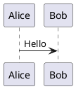

# Markdown → Confluence Mapping Reference

This document maps every [GitHub Markdown](https://docs.github.com/en/get-started/writing-on-github/getting-started-with-writing-and-formatting-on-github/basic-writing-and-formatting-syntax) formatting element to its Confluence Storage Format equivalent, covering both **Confluence Cloud** and **Confluence Server 7.x**.

It serves two purposes:

- **User reference** — what happens to each Markdown element when your docs are synced to Confluence.
- **Developer spec** — target behaviour for `converter.py` and future improvements.

## Status legend

| Symbol | Meaning |
| --- | --- |
| ✅ | Implemented — `converter.py` handles this correctly today |
| ⚠️ | Partial — `converter.py` produces output, but with caveats or approximation |
| 🚧 | Planned — a Confluence equivalent exists, but `converter.py` does not implement it yet |
| ❌ | No equivalent — no meaningful Confluence equivalent; the element is dropped or rendered as plain text |

---

## 1. Text Formatting

### Headings

| Markdown | Confluence equivalent | Cloud | Server 7.x | Status |
| --- | --- | --- | --- | --- |
| `# H1` … `###### H6` | `<h1>` … `<h6>` | ✅ | ✅ | ✅ |

> **Server note:** For reliable in-page anchor navigation on Server 7.x, each heading should be preceded by an explicit Confluence Anchor macro (`ac:name="anchor"`). The current converter generates heading `id` attributes via the TOC extension but does not emit anchor macros. In-page links still work in most cases.

### Inline styles

| Markdown syntax          | GitHub example       | Confluence element | Status |
|--------------------------|----------------------|--------------------|--------|
| `**text**` or `__text__` | **bold**             | `<strong>`         | ✅      |
| `*text*` or `_text_`     | *italic*             | `<em>`             | ✅      |
| `***text***`             | ***bold italic***    | `<strong><em>`     | ✅      |
| `~~text~~`               | ~~strikethrough~~    | `<del>`            | ✅      |
| `<sub>text</sub>`        | H<sub>2</sub>O       | `<sub>`            | ✅      |
| `<sup>text</sup>`        | x<sup>2</sup>        | `<sup>`            | ✅      |
| `<ins>text</ins>`        | <ins>underline</ins> | `<ins>` / `<u>`    | ✅      |

### Paragraphs and line breaks

| Markdown                               | Confluence equivalent | Status |
|----------------------------------------|-----------------------|--------|
| Blank line between text                | `<p>` elements        | ✅      |
| Two trailing spaces or `\` at line end | `<br/>`               | ✅      |

---

## 2. Code

### Inline code

| Markdown | Confluence equivalent | Status |
| --- | --- | --- |
| `` `code` `` | `<code>code</code>` | ✅ |

### Fenced code blocks

| Markdown                    | Confluence equivalent                        | Cloud | Server 7.x | Status |
|-----------------------------|----------------------------------------------|-------|------------|--------|
| ` ```python … ``` `         | Code Block macro with `language=python`      | ✅     | ✅          | ✅      |
| ` ``` … ``` ` (no language) | Code Block macro without language            | ✅     | ✅          | ✅      |
| ` ```mermaid … ``` `        | Diagram macro (see [Diagrams](#4-diagrams))  | ✅     | ✅          | ✅      |
| ` ```plantuml … ``` `       | PlantUML macro (see [Diagrams](#4-diagrams)) | 🚧     | 🚧          | 🚧      |

### Code block language mapping

The Confluence Code Block macro accepts a specific set of language identifiers. The table below shows how common GitHub fence tags map to Confluence language names.

**Server 7.x** has a fixed set of valid identifiers. Any unrecognised tag falls back to `none` (plain text, no highlighting).
**Cloud** supports a larger set; identifiers not listed here are passed through unchanged and will use whatever the Cloud macro supports.

| GitHub fence tag                | Server 7.x identifier | Cloud identifier                   | Notes                                              |
|---------------------------------|-----------------------|------------------------------------|----------------------------------------------------|
| `python`, `py`                  | `python`              | `python`                           | `py` normalised to `python`                        |
| `javascript`, `js`              | `javascript`          | `javascript`                       | `js` normalised                                    |
| `typescript`, `ts`              | `javascript`          | `typescript`                       | Server has no TypeScript; falls back to JavaScript |
| `bash`, `sh`, `shell`           | `bash`                | `bash`                             | All three normalised to `bash`                     |
| `java`                          | `java`                | `java`                             |                                                    |
| `sql`                           | `sql`                 | `sql`                              |                                                    |
| `xml`                           | `xml`                 | `xml`                              |                                                    |
| `html`, `html/xml`              | `html/xml`            | `html/xml`                         |                                                    |
| `css`                           | `css`                 | `css`                              |                                                    |
| `php`                           | `php`                 | `php`                              |                                                    |
| `ruby`                          | `ruby`                | `ruby`                             |                                                    |
| `cpp`, `c++`                    | `cpp`                 | `cpp`                              |                                                    |
| `csharp`, `c#`                  | `csharp`              | `csharp`                           |                                                    |
| `scala`                         | `scala`               | `scala`                            |                                                    |
| `groovy`                        | `groovy`              | `groovy`                           |                                                    |
| `perl`                          | `perl`                | `perl`                             |                                                    |
| `diff`                          | `diff`                | `diff`                             |                                                    |
| `powershell`                    | `powershell`          | `powershell`                       |                                                    |
| `vb`                            | `vb`                  | `vb`                               |                                                    |
| `yaml`, `yml`                   | `yaml`                | `yaml`                             |                                                    |
| `json`                          | `json`                | `json`                             |                                                    |
| `actionscript3`                 | `actionscript3`       | `actionscript3`                    |                                                    |
| `coldfusion`                    | `coldfusion`          | `coldfusion`                       |                                                    |
| `delphi`                        | `delphi`              | `delphi`                           |                                                    |
| `erlang`                        | `erlang`              | `erlang`                           |                                                    |
| `javafx`                        | `javafx`              | `javafx`                           |                                                    |
| `go`, `rust`, `kotlin`, `swift` | `none`                | `go` / `rust` / `kotlin` / `swift` | No Server 7.x support; Cloud may support these     |
| *(none / unrecognised)*         | `none`                | *(passed through)*                 | Plain text; no syntax highlighting                 |

---

## 3. Links

| Markdown                         | Confluence equivalent        | Status | Notes                                                                                                                                |
|----------------------------------|------------------------------|--------|--------------------------------------------------------------------------------------------------------------------------------------|
| `[text](https://example.com)`    | Hyperlink `<a href="...">`   | ✅      |                                                                                                                                      |
| `[text](./other.md)`             | Rewritten to GitHub blob URL | ⚠️      | Relative `.md` links are **not** converted to Confluence cross-page links. They become GitHub blob URLs (e.g. `github.com/…/blob/main/docs/other.md`). Clicking them in Confluence navigates to GitHub, not to the synced Confluence page. Requires `--repo-url`; anchor suffix `#section` is preserved. |
| `[text](#section-heading)`       | In-page anchor link          | ✅      | Anchor IDs generated by the TOC extension. Matches GitHub's slug rules.                                                              |
| `<a name="custom-anchor">`       | HTML anchor (pass-through)   | ⚠️      | Passed through as raw HTML; not converted to a Confluence Anchor macro. On Server, anchor macros are needed for reliable navigation. |
| `https://example.com` (bare URL) | Auto-linked by Confluence    | ✅      |                                                                                                                                      |

---

## 4. Diagrams

Diagrams are authored as fenced code blocks with a diagram-type language tag. The converter replaces them with the appropriate Confluence macro.

### Mermaid

```


```

| Target         | Confluence macro                                                                                                                                   | Status |
|----------------|----------------------------------------------------------------------------------------------------------------------------------------------------|--------|
| **Cloud**      | Diagram macro — exact macro key depends on the installed app (e.g. Atlas Authority "Diagram" app). Pass the macro key via `--mermaid-macro <key>`. | ✅      |
| **Server 7.x** | Mermaid Diagrams for Confluence plugin — macro key is typically `mermaid`. Pass via `--mermaid-macro mermaid`.                                     | ✅      |

When `--mermaid-macro` is not set, Mermaid blocks are rendered as a plain code block labelled `mermaid`.

### PlantUML

```



```

| Target         | Confluence macro                                                              | Status |
|----------------|-------------------------------------------------------------------------------|--------|
| **Cloud**      | Diagram macro — same app as Mermaid; supports PlantUML syntax. Macro key TBD. | 🚧      |
| **Server 7.x** | PlantUML for Confluence plugin — macro key is `plantuml`.                     | 🚧      |

PlantUML blocks are currently rendered as a plain code block. Support is planned (see Phase 2 / config file work).

### How to find your diagram macro key

The macro key (`ac:name` value in the Storage Format) depends on which Confluence app or plugin is installed. To find it:

1. Open any Confluence page in **edit mode**.
2. Insert the diagram macro you want to identify (type `/` and search for it by name).
3. Add some placeholder diagram content and save the page.
4. Open the page **view** and go to **`⋯` (More actions) → View Storage Format** (Cloud) or **Tools → View Storage Format** (Server).
5. In the XML, look for `<ac:structured-macro ac:name="...">` wrapping your diagram content. The value of `ac:name` is the macro key.

Alternatively, call the REST API to retrieve the page body:

```

GET /rest/api/content/{pageId}?expand=body.storage

```

Pass this key to the `--mermaid-macro` flag when running the sync tool.

---

## 5. Images

| Markdown                              | Confluence equivalent      | Cloud | Server 7.x | Status |
|---------------------------------------|----------------------------|-------|------------|--------|
| `` | `` tag (pass-through) | ⚠️     | ⚠️          | ⚠️      |
| ``          | Not resolved               | ❌     | ❌          | ❌      |

**Cloud and Server note:** The `` tag is accepted in Storage Format and renders correctly. However, the native Confluence image element (`ac:image`) allows for captions, borders, and attachment references — these are not produced by the current converter. Remote images display normally; relative image paths cannot be resolved at sync time.

---

## 6. Lists

| Markdown                                 | Confluence equivalent                    | Status |
|------------------------------------------|------------------------------------------|--------|
| `- item`, `* item`, `+ item` (unordered) | `<ul><li>`                               | ✅      |
| `1. item` (ordered)                      | `<ol><li>`                               | ✅      |
| Indented sub-items (nested)              | Nested `<ul>` / `<ol>`                   | ✅      |
| `- [x] done` / `- [ ] todo` (task list)  | Plain `<ul><li>` with `[x]` / `[ ]` text | 🚧      |

**Task list note:** Confluence has a task list element in Storage Format (`ac:task-list` / `ac:task`). The `[x]` / `[ ]` characters are currently preserved as plain text inside a standard list item. Support for converting these to proper Confluence task elements is not yet implemented.

---

## 7. Tables

| Markdown | Confluence equivalent | Status |
| --- | --- | --- |
| `\| col \| col \|` with `\|---\|---\|` separator | `<table><tbody><tr><th>` / `<td>` | ✅ |

The first row is treated as the header row (`<th>`). Column alignment hints (`:---`, `:---:`, `---:`) are not preserved.

---

## 8. Blockquotes and Alerts

### Plain blockquotes

| Markdown | Confluence equivalent | Status | Notes |
| --- | --- | --- | --- |
| `> quoted text` | `<blockquote>` | ⚠️ | Rendered as a plain HTML blockquote. Best practice on Server 7.x is to use the **Info** macro instead for better visual treatment. |

### GitHub Alerts

GitHub Alerts (`> [!TYPE]`) are a GitHub-specific extension. They are not currently detected; all blockquotes — including Alerts — are rendered as plain `<blockquote>`. The target mapping when support is added:

| GitHub Alert     | Confluence macro                    | Appearance                              |
|------------------|-------------------------------------|-----------------------------------------|
| `> [!NOTE]`      | Info macro (`ac:name="info"`)       | Blue info box                           |
| `> [!TIP]`       | Tip macro (`ac:name="tip"`)         | Green tip box                           |
| `> [!IMPORTANT]` | Note macro (`ac:name="note"`)       | Yellow note box                         |
| `> [!WARNING]`   | Warning macro (`ac:name="warning"`) | Red warning box                         |
| `> [!CAUTION]`   | Warning macro (`ac:name="warning"`) | Red warning box (no CAUTION equivalent) |

**Status:** 🚧 Planned — currently rendered as plain `<blockquote>`.

---

## 9. Collapsible content (`<details>`)

GitHub Markdown renders raw HTML, and `<details>`/`<summary>` is a common pattern for collapsible sections.

```html
<details>
<summary>Click to expand</summary>

Hidden content here.

</details>
```

| Target | Confluence equivalent | Status |
| --- | --- | --- |
| Cloud and Server 7.x | Expand macro (`ac:name="expand"`) with the `<summary>` text as the title | 🚧 |

**Status:** 🚧 Planned — the `<details>` block is not currently handled by `converter.py`.

---

## 10. Structural elements

### Horizontal rules

| Markdown | Confluence equivalent | Status |
| --- | --- | --- |
| `---`, `***`, `___` | `<hr/>` | ✅ |

### Footnotes

| Markdown | Confluence equivalent | Status |
| --- | --- | --- |
| `[^1]: note text` | No native equivalent | ❌ |

Confluence has no first-class footnote element. Footnote references and definitions are silently dropped.

### HTML comments

| Markdown | Confluence equivalent | Status |
| --- | --- | --- |
| `<!-- comment -->` | Stripped before conversion | ✅ |

HTML comments are removed and do not appear in the rendered Confluence page.

### Escape characters

| Markdown | Confluence equivalent | Status |
| --- | --- | --- |
| `\*escaped\*` | Literal character rendered | ✅ |

---

## 11. GitHub-specific features (not supported)

These features are meaningful only in the GitHub context. They are dropped or rendered as literal text during conversion to Confluence.

| Feature                          | Example                         | Outcome                            |
|----------------------------------|---------------------------------|------------------------------------|
| User / team mentions             | `@username`                     | Rendered as plain text `@username` |
| Issue / PR references            | `#123`                          | Rendered as plain text `#123`      |
| Emoji shortcodes                 | `:tada:`                        | Rendered as plain text `:tada:`    |
| Color model visualization        | `` `#0969DA` ``                 | Rendered as plain inline code      |
| GitHub sidebar table of contents | Automatic outline from headings | Not reproduced in Confluence       |
| Autolinked repository references | `org/repo#123`                  | Rendered as plain text             |

---

## 12. Summary table

| Category    | Element                                  | Cloud | Server 7.x | Status |
|-------------|------------------------------------------|-------|------------|--------|
| Text        | Headings H1–H6                           | ✅    | ✅         | ✅     |
| Text        | Bold, italic, strikethrough              | ✅    | ✅         | ✅     |
| Text        | Subscript, superscript, underline (HTML) | ✅    | ✅         | ✅     |
| Text        | Paragraphs, line breaks                  | ✅    | ✅         | ✅     |
| Code        | Inline code                              | ✅    | ✅         | ✅     |
| Code        | Fenced code block (with language)        | ✅    | ✅         | ✅     |
| Code        | Fenced code block (no language)          | ✅    | ✅         | ✅     |
| Diagrams    | Mermaid                                  | ✅    | ✅         | ✅     |
| Diagrams    | PlantUML                                 | 🚧    | 🚧         | 🚧     |
| Links       | Inline / external links                  | ✅    | ✅         | ✅     |
| Links       | Relative `.md` links                     | ⚠️    | ⚠️         | ⚠️     |
| Links       | Section (anchor) links                   | ✅    | ⚠️         | ⚠️     |
| Links       | Custom HTML anchors                      | ⚠️    | ⚠️         | ⚠️     |
| Images      | External images                          | ⚠️    | ⚠️         | ⚠️     |
| Images      | Relative images                          | ❌    | ❌         | ❌     |
| Lists       | Ordered / unordered / nested             | ✅    | ✅         | ✅     |
| Lists       | Task lists                               | 🚧    | 🚧         | 🚧     |
| Tables      | Standard tables                          | ✅    | ✅         | ✅     |
| Blockquotes | Plain blockquote                         | ⚠️    | ⚠️         | ⚠️     |
| Blockquotes | GitHub Alerts (`[!NOTE]` etc.)           | 🚧    | 🚧         | 🚧     |
| Collapsible | `<details>` / `<summary>`                | 🚧    | 🚧         | 🚧     |
| Structural  | Horizontal rules                         | ✅    | ✅         | ✅     |
| Structural  | Footnotes                                | ❌    | ❌         | ❌     |
| Structural  | HTML comments                            | ✅    | ✅         | ✅     |
| Structural  | Escape characters                        | ✅    | ✅         | ✅     |
| GitHub-only | `@mentions`, `#refs`, emoji codes        | —     | —          | ❌     |
